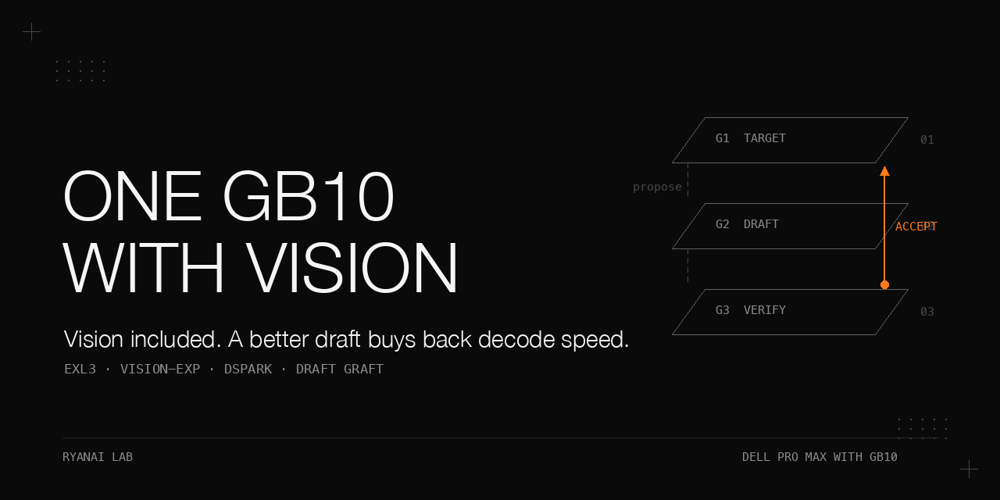

# One GB10, Vision Included

DeepSeek V4 Flash Vision-Exp on one Dell Pro Max with GB10, with an EXL3 target and a grafted speculative draft.

A vision-capable model previously served on a tensor-parallel pair ran on one machine using the community K2.2-D2 EXL3 weights and a locally rebuilt, pinned recipe image.
The column originally labeled two-node baseline reached Qwen3.8-Flash-Next through a shared served alias. It is retained only as a worked example of a mislabeled baseline; the quality cost of moving the intended model from two nodes to one was not measured.
A single 102-minute maximum-thinking session did not reproduce the earlier two-node stall.
Runtime tuning produced no demonstrated gain; substituting the text sibling's draft raised the publishable short-prompt decode rates by about 11-15%, while the vision subset remained inside the measurement noise.
The original quality gate comparison and the rewritten gate were judged against the wrong baseline. Shipped K3 missed its separate native-versus-grafted speed gate.

## Why this matters

The practical gain was freeing the second Dell Pro Max with GB10 while retaining vision on the first.
The quality cost against the intended two-node model remains unestablished, and there is an unresolved reliability obligation: a later power outage left the service down for three days because it had no effective boot path.
The useful recipe includes the metadata surgery, effective-setting checks, failed experiments and rollback evidence, not just a successful launch command.

This is historical evidence from September/October 2026, transcribed from the supplied fact sheet.
**Baseline correction:** the shared alias pointed at Qwen3.8-Flash-Next. [The worked example](docs/baseline-source-conflict.md) records the model and condition differences and invalidates both quality-gate decisions.
Measured, reported, derived and estimated values stay distinct; missing per-run dates are marked rather than inferred.
The private evaluation questions and one private thinking prompt are not published. All results tied to that thinking prompt are excluded.
The replacement prompt is neutral English and has no historical model-rate result.

## What is in this book

| Chapter | What it answers |
|---|---|
| [Deploying the build](docs/deployment.md) | How the pinned image, weights, cache layout and env combine into a working endpoint. |
| [Acceptance evidence](docs/acceptance.md) | How the mislabeled baseline invalidated the original and rewritten quality gates. |
| [Maximum-thinking stress](docs/stress.md) | How to detect a stalled token stream and interpret client-cut generations. |
| [Decode tuning](docs/decode-tuning.md) | How to measure effective runtime arms and know when acceptance limits speed. |
| [Draft graft](docs/draft-graft.md) | How tensor bytes, index entries and mixed-quantization metadata must move together. |
| [Operations](docs/operations.md) | How switching, rollback and boot-time availability can fail independently of model correctness. |

[All tables and conditions](docs/results.md), [expanded pitfalls](docs/pitfalls.md), [offline reproduction](docs/reproduce.md) and [public credits](docs/credits.md) provide the detail behind the chapters.

## The setting

| Role or component | Recorded configuration |
|---|---|
| Production | one Dell Pro Max with GB10; 128 GB unified LPDDR5X, sm_121, aarch64 |
| Bench | a second Dell Pro Max with GB10; same hardware class, about 116 GB available before starts |
| Host memory | MemTotal 127,533,268 kB (121.6 GiB), 16 GiB swap |
| Platform | DGX OS 7.6.0; kernel 7.0.0-1019-nvidia; driver 580.178.04; updated 2026-09-18 |
| Recipe | `tpurtell/ds4-mia-exl3-k2-1spark` at `b6b1ef44595ac995bd067d49c00960304c882a8a` |
| Runtime | vLLM `0.25.2.dev0+g752a3a504.d20260714`, pinned b12x serving fork, `instanttensor==0.1.5`, dSpark, FP8 DS-MLA KV |
| Target revision | `8347bfb8776287ef2dcab2b46e9f15c655825c3a` |
| Donor revision | `7827301eed170e2a5e394f45a13cc66561c601ed` |
| Container tooling | Docker and NVIDIA container toolkit; versions not recorded |

The [deployment chapter](docs/deployment.md#components-and-provenance) records both base-image digests and the serving-fork commit.
Weights occupy 91.9 GB, the local image 18.9 GB and the extra graft file 5.94 GB, before build and tuning caches.
At least 150 GB free was a planning figure, not a measured minimum; the machines actually had 2.4-2.7 TB free.
A second machine is useful for A/B experiments but is not required to serve the model.
The public scripts use Python's standard library, with Bash/curl for shell wrappers; acquiring weights requires `huggingface_hub`.

## Chapter 1 — Deploying the single-node build

**Problem.** The pair occupied both machines, the author's release returned `unauthorized`, and the entrypoint could not resolve weights from an arbitrary local directory.
Anonymous tag and digest pulls failed on 2026-09-25 and 2026-09-26; the two Dockerfile bases remained pullable.

**Mechanism.** Build the recipe's own Dockerfile at its pinned commit, then place the pinned target in the Hugging Face cache structure.
`HF_CACHE` names the directory containing `hub/`; the snapshot sits under `models--wrldsuksgo2mars--DeepSeek-V4-Flash-Vision-Exp-EXL3-K2.2-D2-v1/snapshots/<revision>`.
`refs/main` contains the revision.
The target card reports exactly 2.2 bpw across routed experts of 43 decoder layers, with K2/K3 allocation 3:5:8 across gate/up/down and uniform K2 draft blocks.
Non-routed tensors retain source values, including the vision encoder and aligner; calibration was text only, 1,426 prompts and 1,081,027 tokens.

**Procedure as run.** Build `ve-single:b6b1ef4`, download the pinned weights into a plain directory, finalize the cache layout, launch, warm up, then validate text, image and an essay.
The finalizer requires a log line `DL_EXIT=0`, moves the completed download, removes its `.cache`, writes the ref and writes the reference env.
The build took roughly half an hour while sharing bandwidth with the roughly 50-minute download; exact build flags other than the image tag were not recorded.

```bash
bash scripts/ve-finalize-layout.sh models/ve-k22-d2 hf recipe logs/download.log
(cd recipe && ./launch.sh --nodes 1)
bash scripts/ve-validate.sh http://127.0.0.1:8888 deepseek-v4-flash-vision-exp recipe/image.png results
```

These are generic paths for already-acquired assets; [full acquisition commands and prerequisites](docs/deployment.md#procedure-as-run-with-generic-paths) are reconstructed and labeled there.
The reference env sets MAX_MODEL_LEN=256000, MAX_NUM_SEQS=6, MAX_NUM_BATCHED_TOKENS=8192 and DEFAULT_THINKING=max.
A blank utilization value resolves to 0.86 for this model; DSPARK_TOKENS is omitted and defaults to 3.
Those are the historical settings, not proof that another host has enough free memory.

Conditions: measured single-node deployment in September 2026; initial cut-over 2026-09-26, individual probe timestamps not recorded; warm-start sample n = 8 boots.

| Check | Recorded result |
|---|---|
| Weight files | 91,886,448,032 bytes (85.58 GiB), 31 files |
| Weight load | 87.12 GiB in 52.6 s, first start |
| Healthy, tuning caches present | 90-135 s, page cache dropped before each boot |
| Healthy, tuning caches empty | about 5-7 min |
| KV pool, fp8_ds_mla | 585,831-637,044 tokens, 0.86 utilization |
| Image validation | correct sample description; 390 prompt tokens, 11.6 s, caches still warming |
| Essay throughput | 485 tokens / 20.6 s = 23.5 tok/s, includes prefill |

**What did not work.** Anonymous release pulls failed; copying all cache files with unprivileged rsync failed with exit 23 on root-owned tuning caches.
Copy snapshots only and expect a cold tuning cost. The first cold short answer took 12 s; it was not a steady-state benchmark.

**Rule.** Pin the recipe and weights, satisfy cache resolution, and pass a text request, image request and throughput check before benchmarking.

## Chapter 2 — Is it good enough?

**Problem.** A one-machine choice needed evidence for vision, long context and the quality trade-off against the pair and a text-only single-node control.

**Mechanism.** Run the private 11-category bank twice per category; retain medians and spread, and separate own 0/1 categories from pack 0/1/2 categories.
Spread above 5 points marks runs not comparable by the harness rule.
The original gates intended to allow at most -3 on own mean and vision against the pair, with no new pack safety failures, but the quality comparison actually used the wrong model behind the shared alias.
The public comparison tool accepts aggregate result files and reports arithmetic only; it cannot verify model identity or judge quality gates. The private question bank is not included.

**Procedure as run.** Probe nominal 128000 and 245000-token filler lengths with max_tokens 1500 and timeout 1700; then run harness-uniform/low twice, parallel 1, with an additional C9 re-run.
The wrappers' exact workload flags are [documentation](docs/acceptance.md#procedure-and-the-exact-session-flags), not runnable substitutes for the missing bank.

**Worked example of a mislabeled baseline.** The column originally labeled two-node baseline measured Qwen3.8-Flash-Next on 2026-09-24; single-node DeepSeek arms ran on 2026-09-26. Two runs/category, medians; own and pack remain separate. Deltas below are historical arithmetic only, not a two-to-one quality cost.

| Metric | Mislabeled two-node baseline: Qwen3.8-Flash-Next | Single-node vision | Arithmetic vs wrong baseline | Text-only control |
|---|---|---|---|---|
| Own mean, 8 categories | 90.0 | 85.6 | -4.4 | 74.0; 84.6 without vision |
| Pack mean, 3 categories | 88.1 | 81.7 | -6.4 | 74.7 |
| Vision, 40 items | 83.8 | 76.2 | -7.5 | 0.0, no vision |

Conditions differ: Qwen3.8-Flash-Next behind the shared alias versus DeepSeek single-node models; a different grader build; output budget `max_tokens` 16,384 versus 8,000; timeout x2.048 versus x1.0; and thinking keys/application (baseline request enabled thinking with proxy-forced low, versus `--thinking on` and request `reasoning_effort: low`). Exact baseline thinking-key spelling and grader identifiers are not recorded here.
The baseline pack categories came from a separate port-forwarded re-run after a client network-permission failure; single-node pack categories were collected with the other categories. The same bank hash for the eight own categories did not repair these differences. No quality conclusion is drawn from the mislabeled column.
The vision/control comparison is cleaner, but the vision engine generated about 2x to 16x as many completion tokens at nominal low effort.
[Every category, run, condition and token total](docs/results.md#worked-example-mislabeled-two-node-baseline) is retained in the ledger.

Conditions: needle measurements in September 2026, exact probe dates not recorded; one run at each length, temperature 0, server-default thinking, periodic filler at depths 0.50 and 0.44.

| Actual prompt tokens | Answer | TTFT | Derived prefill |
|---|---|---|---|
| 128,146 | exact | 123.3 s | 1,039 tok/s; 0 cached tokens |
| 245,146 | exact | 178.1 s | 1,031 tok/s on uncached part; 61,440 cached tokens |

**What did not work.** The original quality gate comparison and the rewritten gate were judged against the wrong baseline.
The historical original thresholds were own and vision >= -3; the rewrite used own >= -5, vision present and >= 70, and pack >= 80. The own threshold still depended on the Qwen3.8-Flash-Next scores, so neither gate version established acceptance against the intended two-node model.
The absolute vision and pack scores remain observations; they do not repair the invalid comparison.
C9's intended doubled-timeout re-run actually retained x1.0 and must be read as a plain re-run.
At maximum effort, the control's non-vision own medians averaged 90.1, above the vision build's 86.9 at low; no maximum-effort vision bank comparison was run.

**Rule.** Verify the model behind the reference, then publish both versions of a changed gate and the effective conditions. A shared arm name does not make the arms like-for-like.

## Chapter 3 — The 102-minute stress run

**Problem.** The two-node stack had hung twice at maximum effort and max_tokens 32,768 while health stayed 200.

**Mechanism.** Start concurrent streaming clients, count tokens from usage, detect socket silence, and sample health, optional container state and memory.
The original detector used 180 s without bytes, a 1,700 s client cap and 120 s heartbeats.
A finished stream must not be mistaken for a stalled stream merely because its last-delta age grows.

**Procedure as run.** In one production session, run max x2, max x4, max x6, then high x2 directly against the engine, all at temperature 0.6 and 32,768 output tokens.
Some live fallback traffic continued during the session. Exact date is not recorded beyond September 2026.

Conditions: one measured session, four back-to-back rounds; per-stream rates from usage; x6 aggregate is estimated because five streams lacked final usage.

| Round | Wall | Outcome | Aggregate |
|---|---|---|---|
| max x2 | 1,440.5 s | both reached 32,768 tokens | 45.5 tok/s |
| max x4 | 1,560.6 s | 3 reached length; 1 stopped at 13,145 | 71.4 tok/s |
| max x6 | 1,800.5 s | 1 stopped at 21,795; 5 client-cut at 1,700 s | about 90-100 tok/s, estimated |
| high x2 | 1,320.3 s | 1 reached length; 1 stopped at 28,384 | 46.3 tok/s |

Across 102 minutes: stalls 0, server-metric preemptions 0, MemAvailable 6.9-7.2 GiB, KV occupancy about 3%.
The x6 estimate spans 89-103 tok/s, 93 at the mean character/token ratio, with roughly 15% uncertainty; [the ledger](docs/results.md#maximum-thinking-stress) gives every input and per-stream result.

**What did not work.** Five x6 streams exceeded the client's time budget, so this was not a completed full-length x6 rate test.
Counting deltas initially understated speed by about three times because speculative batches contain multiple tokens.
A successful single-node session does not explain or rule out the two-node hang.

**Rule.** Detect stalls at the token stream, use usage for token counts, and distinguish client cuts from engine failures.

## Chapter 4 — The knobs that did not move decode

**Problem.** Prose decoded at about 24-25 tok/s; code at about 39. Runtime tuning seemed the first place to look.

**Mechanism.** Throughput depends on speculative step cost and accepted tokens per step.
The local native acceptance mean was 2.51; reported discussion results suggested draft acceptance changed much more with workload than step frequency.
The suite uses short prompts, random 6-hex prefixes, one warm-up, three trials/class and median completion_tokens/(wall-TTFT).
Each arm needs its own env file because the launcher sources that file after caller variables.

**Procedure as run.** On the idle bench, test clock lock, one sequence, greedy draft sampling, one next-layer, NVFP4 KV, corrected repeats, then two newer b12x builds.
Only arms whose effective settings matched intent counted as those variants.

Conditions: measured September 2026, exact arm dates not recorded; median of 3 trials per class, thinking off, 512 tokens, temperature 0.6/top_p 0.95; one boot per arm.

| Arm | Code | JSON | Words | Prose | Result |
|---|---|---|---|---|---|
| Native | 38.3 | 31.9 | 34.9 | 24.0 | reference |
| Clock lock, 3,003 MHz | 35.7 | 32.3 | 35.7 | 23.7 | no gain; post-run clock not retained |
| Greedy draft, corrected repeat | 39.6 | 32.0 | 35.6 | 23.0 | no gain; acceptance 2.52 |
| One next-layer | 36.6 | 32.9 | 31.0 | 24.4 | loader ignored value |
| NVFP4 KV, corrected repeat | 39.3 | 32.3 | 35.1 | 23.6 | no gain; acceptance 2.59 |

**What did not work.** Three first attempts accidentally ran baseline settings; the corrected single-sequence attempt failed with its root-cause log lost.
Both newer kernel builds failed against the pinned engine/adapter APIs, so neither has throughput results.
Five native replicates show 18% range for words, versus 4% code, 3.5% JSON and 5.6% prose; small word-list gains cannot be resolved here.
The [full table](docs/results.md#runtime-arms) retains ineffective arms, failure signatures and unrun experiments.

**Rule.** Inspect effective settings, retain logs and repeat baselines. Unchanged acceptance across the tested knobs motivated changing draft weights.

## Chapter 5 — Grafting a better draft

**Problem.** The text sibling's draft looked more accurate, but the target needed to retain vision and its pinned serving stack.

**Mechanism.** Read donor safetensors headers; copy `mtp.*` bytes; append the three visual gate biases from same-level donor biases; and publish a separate snapshot.
Both drafts use target layers [40, 41, 42], block size 5 and Markov rank 256, but 461 expert tensor shapes differ because donor D2.2 mixes K2 and K3.
Repoint every draft tensor in the index, recompute referenced total_size, replace draft tensor_storage, and copy the mixed namespace into both config locations.
Keep unchanged files as relative links to the original snapshot.
Strict HTTP 206/Content-Range/body checks prevent a plausible-size but wrong byte copy; independent SHA-256 comparisons verify the payload.

**Procedure as run.** Dry-run inventory, graft, sampled then full byte verification, two-boot native/graft A/B, width sweep, thinking check, capability subset, then production switch on 2026-09-27.
The donor inventory was re-checked on 2026-10-03: 9,313 tensors, 5.94 GB, three payload range requests.
Historical full verification found 0 mismatches and all 3 derived biases equal; this was distinct from the offline synthetic verification in this repository.
Deployment added one MODEL_REVISION line; K3 kept the image and entrypoint unchanged.

Conditions: measured idle bench before the 2026-09-27 switch; exact boot timestamps not recorded; median of 3 trials/boot, two boots/side for thinking-off rows; English thinking is one boot/side, 3 trials, high effort, 1,024 tokens.

| Class | Native mean tok/s | Graft K3 mean tok/s | Derived change |
|---|---|---|---|
| code | 38.25 | 43.5 | +13.7% |
| JSON | 32.05 | 35.8 | +11.7% |
| word list | 34.05 | 39.1 | +14.8% |
| prose | 23.6 | 26.3 | +11.4% |
| thinking, English | 26.4 | 30.2 | +14.4% |

**What did not work.** K3 missed the pre-set prose +15% or code +20% gate; K5 technically passed with code +24% and worst class -4.6% but regressed prose.
K3 was chosen for improvement across shapes, measured thinking behavior and the unchanged image.
The capability subset gave vision 80.0 against native median 76.2, but that was one run versus two, n = 40, inside the noise.
C1 was -1.7 against the incumbent median and strictly missed the minus-1 rule; it was accepted as single-item noise without a re-run.
No greedy byte-output equality test was run. The 24-hour observation has no closing record: no incident was recorded.

**Rule.** Move bytes and metadata together, verify against the pinned source, and publish the speed/capability gates even when the chosen configuration misses them.
See [full graft mechanics](docs/draft-graft.md), [width sweep](docs/results.md#graft-width-sweep) and [production results](docs/results.md#production-after-the-graft).

## Chapter 6 — Operating it

**Problem.** Correct weights did not guarantee a correct switch, rollback or boot-time service.

**Mechanism.** The recorded switch serialized invocations, stopped services, started proxy ports before the engine, and checked the actual loaded revision.
Rollback stood the service down, restored the original revision, restarted in order and checked container start time and snapshot path rather than the served alias.
The private switch implementation and fallback topology are not shipped.

**Procedure as run.** Initial cut-over on 2026-09-26; graft switch on 2026-09-27 with a second attempt after correcting proxy startup order; recovery after a later power outage.
Four review rounds found problems with self-matching process searches, background-start readiness, swallowed failures, incomplete idempotency, cleanup ownership and double unlocks.
A final fix pass was not re-reviewed; no round found corrupted weights.

Conditions: recorded operations, not repeated timing trials; durations approximate where stated.

| Event | Result |
|---|---|
| Initial cut-over, 2026-09-26 | about 8 minutes |
| Graft switch, 2026-09-27 | about 7 minutes, two attempts |
| Power outage, 2026-09-29 | about 20:23-21:13 local; machines returned at 21:13 |
| Service outage detected, 2026-10-02 | ports had remained down for three days |
| Recovery | about 5 minutes after confirming the other machine idle |

**What did not work.** The actual launcher container had restart policy no; proxies were background processes; the monitor alerted only once per state change.
The recipe's compose policy was unless-stopped, but that did not describe the running container.
A boot path was not added because of concern about restart loops after a maximum-thinking failure; the reliability gap remains open.

**Rule.** Verify actual revision and process ownership during switches, and supply a boot path plus an alert that repeats until acknowledged.

## Pitfalls

| Symptom | Root cause | Fix |
|---|---|---|
| Model missing | wrong cache layout | pinned snapshot plus refs/main |
| Arm behaves like baseline | env file overwrote caller settings | separate ENV_FILE; inspect effective arguments |
| Empty visible answer | maximum thinking exhausted output budget | disable thinking or select a tier deliberately |
| Fast larger needle | prefix-cache reuse | inspect cached_tokens and separately test shuffled filler |
| Low reported decode | deltas counted as tokens | require completion usage |
| Graft loads wrong draft | stale index or invalid links | remap all mtp entries and use relative links |
| Graft fails to load | stale storage/mixed namespace/total_size | rewrite all related metadata |
| Service absent after reboot | no effective restart path | boot supervision and repeated alerting; still open here |

[Expanded pitfalls](docs/pitfalls.md) explain the failure mechanism, evidence and remaining uncertainty for each stage.

## Reproduce it without our infrastructure

1. Run the offline contract tests and the original eight-case range self-test:

```bash
PYTHONDONTWRITEBYTECODE=1 python3 -m unittest discover -s tests -p test_offline.py -v
PYTHONDONTWRITEBYTECODE=1 python3 tests/test_graft_range.py
```

2. Build tiny synthetic data, then exercise graft creation and full byte verification through the in-memory HTTP transport:

```bash
python3 fixtures/build.py fixtures/generated
TARGET=fixtures/generated/snapshots/8347bfb8776287ef2dcab2b46e9f15c655825c3a
python3 fixtures/offline.py fixtures/generated/donor scripts/graft0731.py --target "$TARGET" --source-base http://127.0.0.1:8888
python3 fixtures/offline.py fixtures/generated/donor scripts/verify_graft_bytes.py --local fixtures/generated/snapshots/0731d22a00000000000000000000000000000001/model-mtp-draft0731-d22.safetensors --source-base http://127.0.0.1:8888 --all
```

3. Exercise aggregate comparison and the recorded needle argument chain:

```bash
python3 scripts/g2_compare.py --runs fixtures/generated/runs --baseline synthetic-reference --vision vision --control control
bash scripts/run-ve-chain.sh --dry-run
```

4. Follow [the offline walkthrough](docs/reproduce.md) for suite, needle, stress and optional loopback-server examples.
Tests use synthetic bytes, mocked HTTP and stub commands; their rates and scores are not model measurements.
The comparison output is arithmetic only and does not issue quality-gate verdicts from unverified result rows.
No network or GPU is needed for them. Real socket serving and Docker image construction were not validated in this publication environment.
5. For the hardware experiment, acquire the pinned public assets and follow [deployment](docs/deployment.md); supply your own evaluation harness and record every effective condition.
The private bank and private switch cannot be reproduced from these fixtures.

## Limits and open questions

- One production machine and one bench, one pinned image/model family; no third-machine replication.
- The mislabeled two-node baseline measured Qwen3.8-Flash-Next behind a shared alias. No valid same-model topology comparison exists; budgets, timeouts, grading and thinking keys also differed.
- Nominal low effort produced different token counts; vision calibration was text only and the vision test had 40 items.
- Graft capability is a single subset run; no greedy byte-equality test was run.
- Speed evidence uses short prompts; no graft result at 100K context or six-way concurrency exists.
- Word-list spread is 18%; effects below about 15% are unresolved there.
- Both original and rewritten quality gates were judged against the wrong baseline. Separate shipped speed and C1 capability gates strictly missed.
- The synthetic replacement thinking prompt has no measured model result; the post-graft observation was never closed.
- Registry availability, unspecified host-tool versions, boot recovery and the two-node hang remain unresolved prerequisites or questions.

## Files

| Location | Purpose |
|---|---|
| `docs/results.md`, chapter pages, `docs/pitfalls.md` | complete publishable tables, mechanisms, conditions and failures |
| `docs/reproduce.md`, `docs/credits.md` | offline walkthrough, boundaries and exact public credits |
| `scripts/` | adapted deployment, validation, probes, comparison, A/B and graft tools |
| `configs/` | reference env, vision-only pinned manifest, experimental guarded Dockerfile |
| `fixtures/` | synthetic data builder, in-memory transport and optional loopback server |
| `tests/` | offline contract coverage and strict range self-test |
| `docs/make_banner.py` | Banner script; `docs/assets/banner.png` was rendered from it |
| `LICENSE`, `.gitignore` | unchanged supplied templates |

## Related cookbooks

Related public repositories:

- [dell-pro-max-gb10-deepseek-v4-flash-vision-exp](https://github.com/ryangu00/dell-pro-max-gb10-deepseek-v4-flash-vision-exp) — two-node deployment, hang signature and cold-prefill ladder.
- [dell-pro-max-gb10-deepseek-v4-flash-exl3](https://github.com/ryangu00/dell-pro-max-gb10-deepseek-v4-flash-exl3) — related text-only single-node cookbook.
- [dell-pro-max-gb10-thinking-tier-proxy](https://github.com/ryangu00/dell-pro-max-gb10-thinking-tier-proxy) — tier selection and startup ordering.
- [dell-pro-max-gb10-vllm-stack-ab](https://github.com/ryangu00/dell-pro-max-gb10-vllm-stack-ab) — two-node stack selection and the designed but unrun hang A/B.
- [ryanai-evalbank](https://github.com/ryangu00/ryanai-evalbank) — category method, median-of-two and spread rules.
- [dell-pro-max-gb10-uma-memory-pitfalls](https://github.com/ryangu00/dell-pro-max-gb10-uma-memory-pitfalls) — unified-memory headroom and fit retests.
- [dell-pro-max-gb10-zero-downtime-model-swap](https://github.com/ryangu00/dell-pro-max-gb10-zero-downtime-model-swap) — stable serving-name aliasing.
- [dell-pro-max-gb10-qwen3.8-27b-dflash2-exl3](https://github.com/ryangu00/dell-pro-max-gb10-qwen3.8-27b-dflash2-exl3) — related speculative decoding results.
- [dell-pro-max-gb10-qwen3.8-27b-mtp-k-sweep](https://github.com/ryangu00/dell-pro-max-gb10-qwen3.8-27b-mtp-k-sweep) — another speculation-width sweep.
- [dell-pro-max-gb10-ota-kernel7-kho](https://github.com/ryangu00/dell-pro-max-gb10-ota-kernel7-kho) — the platform update used here.

## License

Apache-2.0; see [LICENSE](LICENSE), copied as supplied.
Recipe license check dated 2026-10-04: MIT, LICENSE present; target, donor and control model cards state MIT.
[Credits](docs/credits.md) preserve the public recipe, weight and discussion handles and distinguish upstream licenses from this cookbook's license.
